# Campus Guide

[](https://travis-ci.org/josephroqueca/campus-guide)
[](https://david-dm.org/josephroqueca/campus-guide)
[](https://david-dm.org/josephroqueca/campus-guide?type=dev)
[](https://codecov.io/gh/josephroqueca/campus-guide)


A mobile app, developed with React Native, to help students of the University of Ottawa find their classes on campus.

## Contributing

### Setup

1. Clone the repository: `git clone https://github.com/josephroqueca/campus-guide``
2. Make your changes.
3. Ensure the following requirements for a contribution are met when running these commands:
    - `yarn run lint`: There should be no errors (warnings are OK).
    - `yarn test`: All tests should pass.
    - If you create any utility methods or files (src/util), ensure there are tests.

### Travis CI

Travis CI runs the following commands, which must succeed in order for your changes to be accepted:

- `yarn run lint`
- `yarn run test`

## Screenshots

*As of January 20, 2018*

### Android

| Splash Screen | Finding a class | Your schedule |
|:-------------:|:---------------:|:-------------:|
| 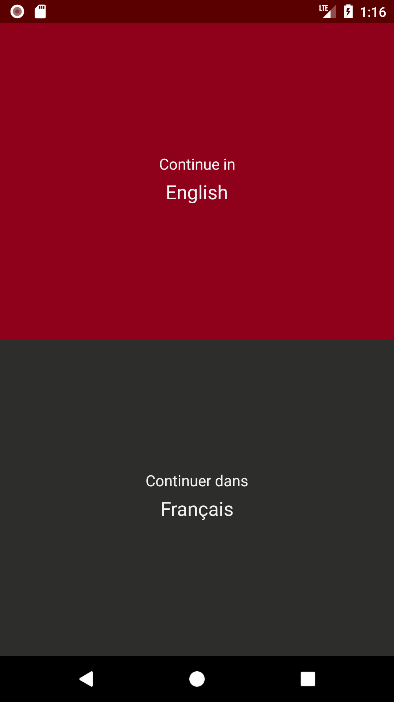 | 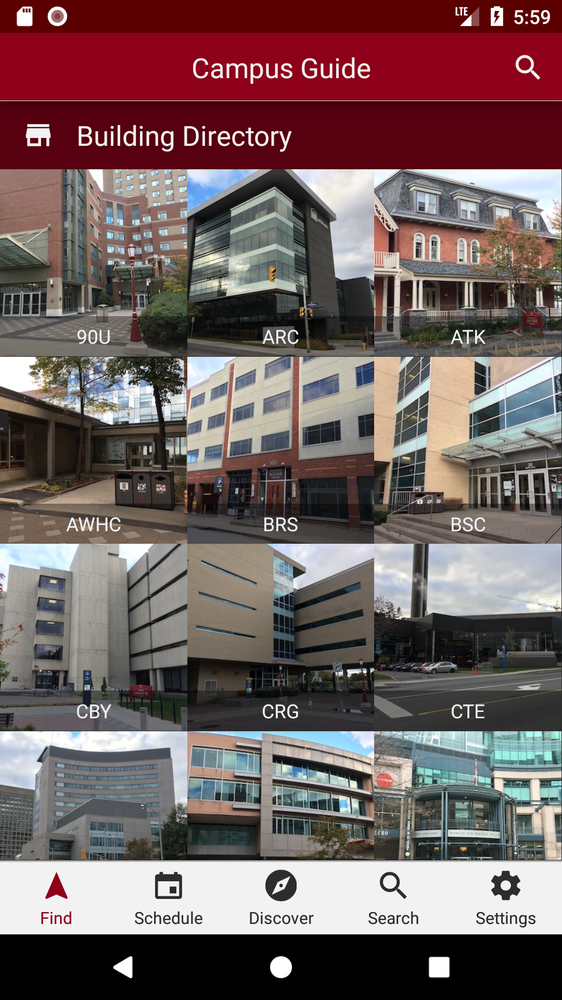 | 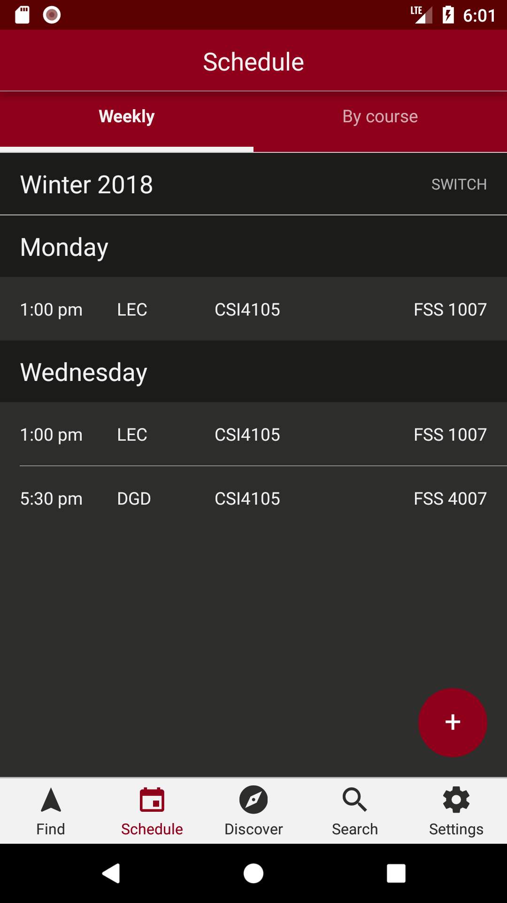 |

| Discover | Search | Settings |
|:--------:|:------:|:--------:|
| 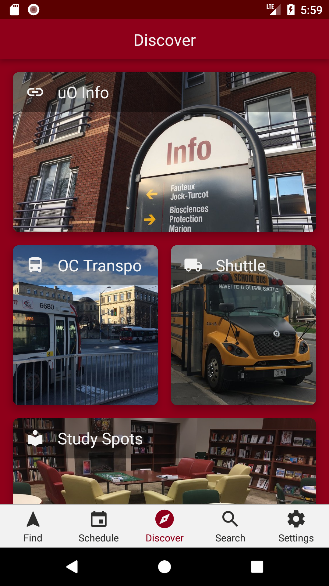 | 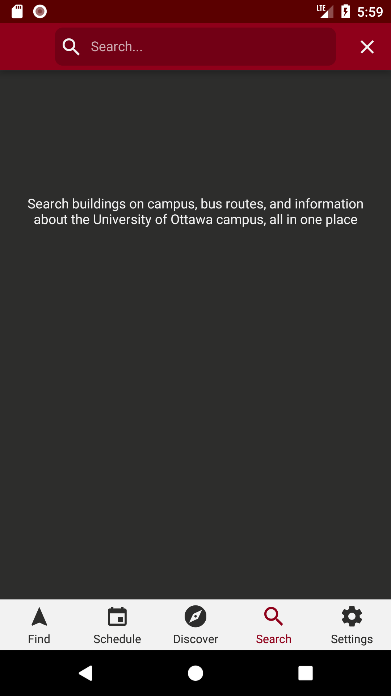 | 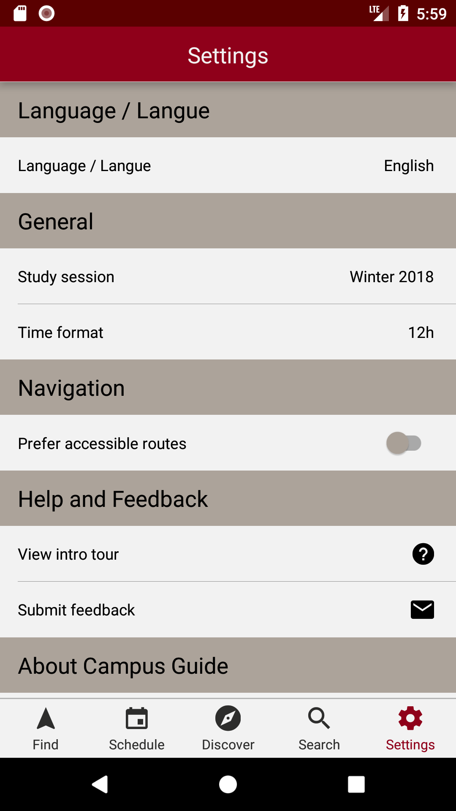 |

### iOS


| Splash Screen | Finding a class | Your schedule |
|:-------------:|:---------------:|:-------------:|
| 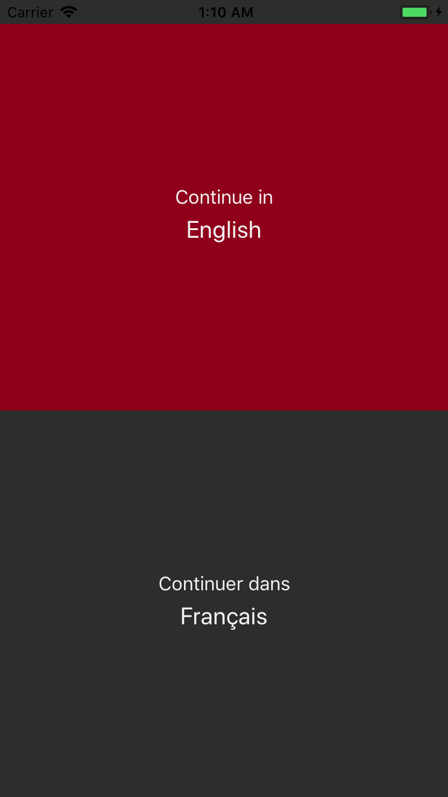 | 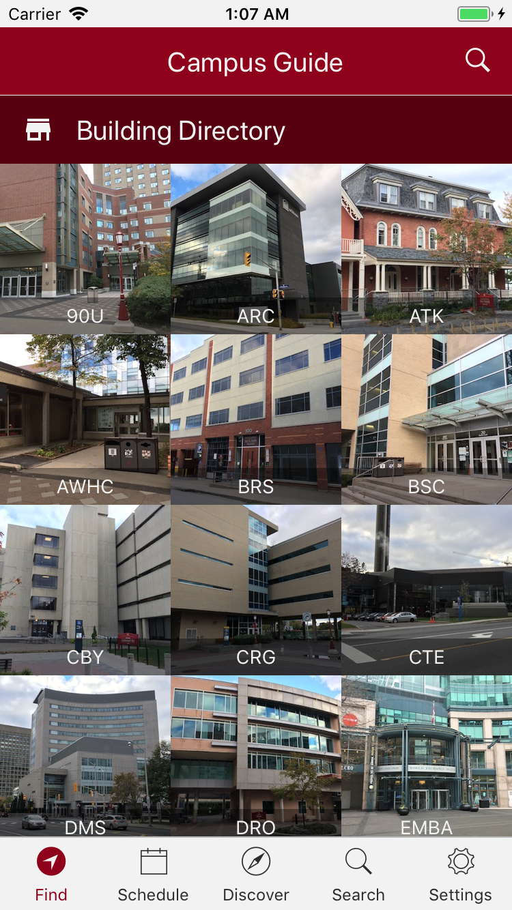 | 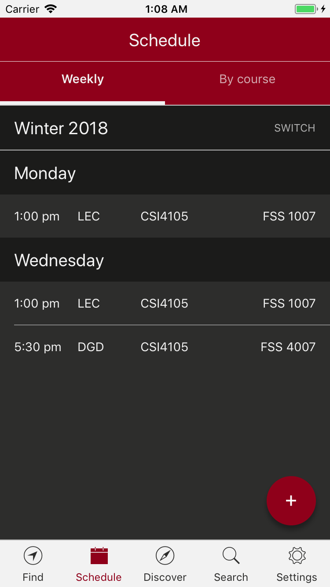 |

| Discover | Search | Settings |
|:--------:|:------:|:--------:|
| 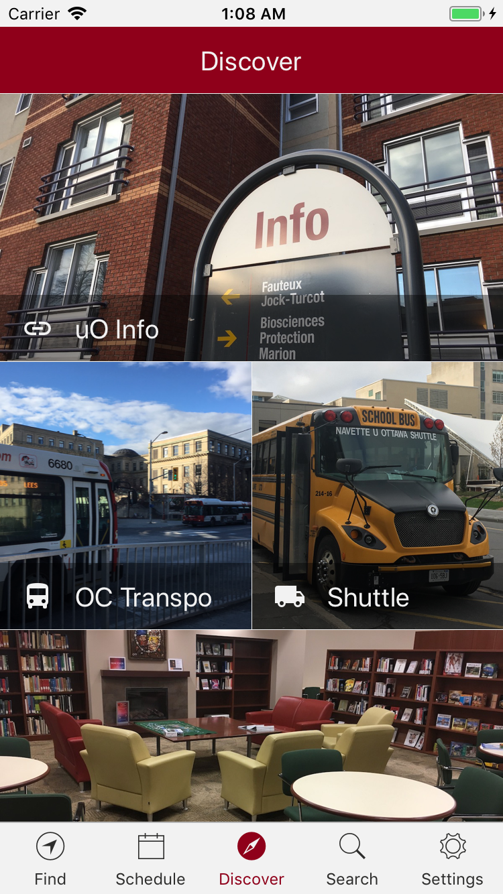 | 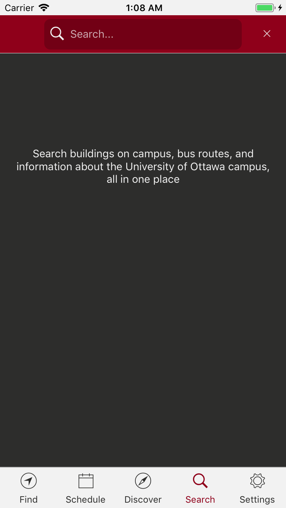 | 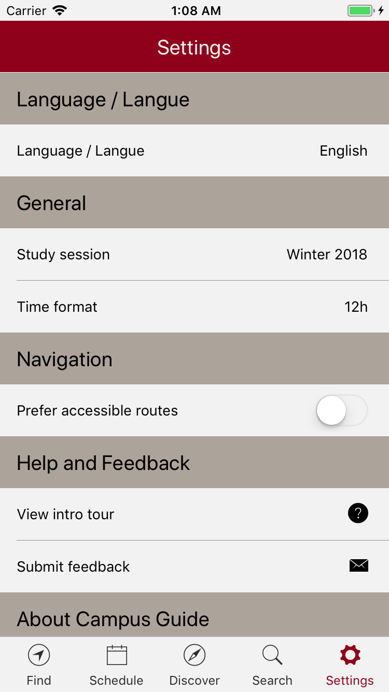 |

## License

```
Copyright 2016-2018 Joseph Roque

Licensed under the Apache License, Version 2.0 (the "License");
you may not use this file except in compliance with the License.
You may obtain a copy of the License at

http://www.apache.org/licenses/LICENSE-2.0

Unless required by applicable law or agreed to in writing, software
distributed under the License is distributed on an "AS IS" BASIS,
WITHOUT WARRANTIES OR CONDITIONS OF ANY KIND, either express or implied.
See the License for the specific language governing permissions and
limitations under the License.
```
